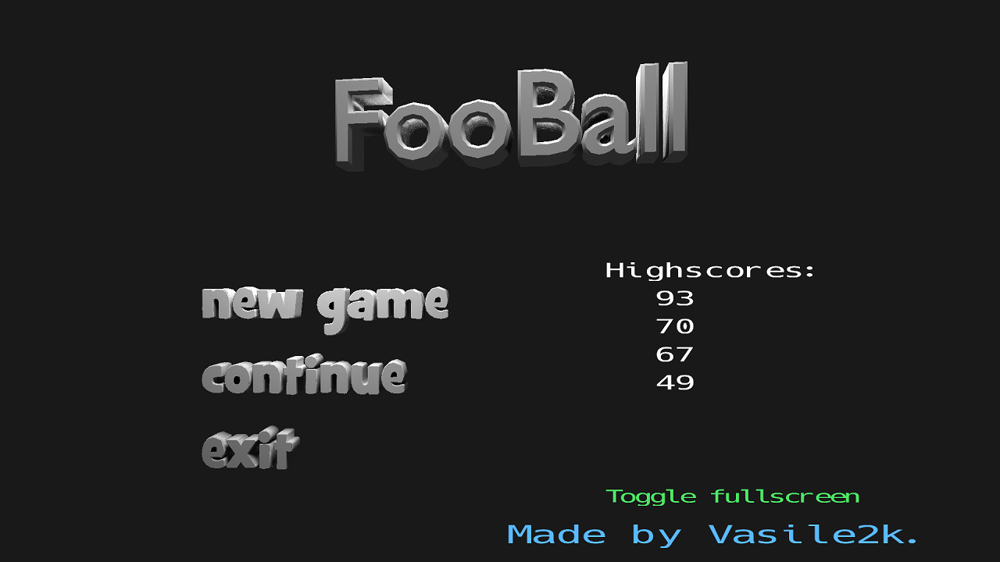
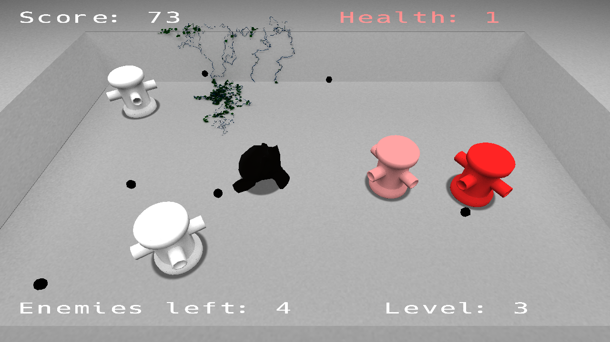

# FooBall
A game w/8 a ball... a foo ball

<ul>
	<li>Characters:
		<ul>
			<li>Suzanne, the monkey. That’s you. Shoot those turrets.</li>
			<li>Turrets. Spawned randomly, these rotate and shoot faster as you increase in level. Be careful, at the next level, there will be more of them.</li>
		</ul>
	</li>
	<li>Gameplay:
		<ul>
			<li>Shoot, run, shoot and run again until you destroy all of them. Be ready for the next wave.</li>
		</ul>
	</li>
	<li>Controls:
		<ul>
			<li>W – Move forward.</li>
			<li>S - Move backward.</li>
			<li>A – Rotate clockwise.</li>
			<li>D – Rotate counterclockwise.</li>
			<li>Space – Shoot!</li>
		</ul>
	</li>
</ul>

## Building
Dependencies:
* [LWJGL](https://github.com/LWJGL/lwjgl3)
* [JDBC](https://bitbucket.org/xerial/sqlite-jdbc/src/default/)
* [JOML](https://github.com/JOML-CI/JOML)

Open the project in IntelliJ, add the required libraries and run the project... I guess
## License
* This thing is distributed under [Apache 2.0 license](LICENSE)
* This thing uses [LWJGL](https://www.lwjgl.org/) which is distributed under [BSD 3-Clause "New" or "Revised" License](https://github.com/LWJGL/lwjgl3/blob/master/LICENSE.md)
* This thing also uses [JDBC](https://bitbucket.org/xerial/sqlite-jdbc) which is distributed under [Apache License Version 2.0](https://bitbucket.org/xerial/sqlite-jdbc/src/default/LICENSE)
* Again, this thing uses [JOML](https://github.com/JOML-CI/JOML) distributed under [MIT License](https://github.com/JOML-CI/JOML/blob/master/LICENSE)
* Bitmap font stolen from a resource pack for Minecraft, I think Pulchra, but not sure...